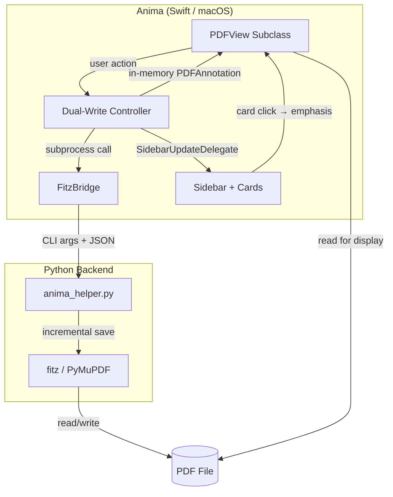

# Anima

**A minimal, no-frills PDF reader for annotation work.**

Latin *anima* — "soul": what's left when you strip everything else away.

---

## Vision

Anima exists to serve one workflow: reading academic papers and wisdom tradition
texts, highlighting passages, and adding comments. It replaces PDF-XChange Viewer
in a macOS-native toolchain that flows from PDF → highlights → Obsidian notes.

**Core Philosophy:**

- **Minimalism**: Open. Read. Highlight. Comment. Save. That's it.
- **Non-destructive**: Incremental save via fitz preserves all existing annotations.
- **Toolchain-native**: Annotations are fully compatible with the `pdf-annotations`
  extraction pipeline and the `pdf://` URL scheme for Obsidian integration.
- **Single user**: Built for Frank. Configuration in code, not preferences dialogs.

**What Anima Does NOT Do:**

Print, sign, fill forms, edit PDF content, draw, stamp, redact, PDF/A compliance,
thumbnail panels, bookmarks, touch-optimized UI, preferences dialog, or anything
that adds complexity without serving the highlight+comment workflow.

---

## Architecture

Anima uses a hybrid approach: **PDFKit for rendering**, **fitz for writing**.



### Why Hybrid?

PDFKit's `writeToURL` is destructive to existing annotations:
- Loses opacity values (-1 instead of 0.4)
- Loses annotation IDs (the `/NM` field)
- Converts timezone representations in dates
- Doubles file size (full rewrite instead of incremental)
- Subtly shifts annotation rect coordinates

fitz's `save(incremental=True)` preserves everything. PDFKit remains ideal for
rendering, scrolling, text selection, zoom, and hit-testing.

### Dual-Write Pattern

When creating, editing, or deleting highlights during a session:

1. **Persist to disk** — call `anima_helper.py` via subprocess, which uses fitz
   to write the annotation with incremental save.
2. **Update in-memory** — add, modify, or remove a `PDFAnnotation` in PDFKit's
   in-memory document for immediate display.
3. **Notify sidebar** — call `sidebarDelegate.annotationsDidChange(onPageIndex:)`
   so the sidebar rebuilds the affected page's cards.
4. **No reload** — the document is never reloaded during a session, eliminating
   the scroll drift that plagued both PoCs.

On next app launch, PDFKit loads the fitz-written file from disk. The file is
the single source of truth.

### Coordinate Systems

This is the critical cross-language contract:

- **PDFKit**: origin at **bottom-left**, y increases upward
- **fitz**: origin at **top-left**, y increases downward
- **Conversion**: `y_fitz = page_height - y_pdfkit`

The coordinate flip happens in Swift (`AnimaPDFView`) before calling the helper.
The helper receives fitz-native coordinates only — it has no knowledge of PDFKit.

**Note:** PDFKit's `annot.bounds` does not directly match the raw PDF `/Rect`
values. PDFKit transforms the coordinates internally. When building test fixtures,
always use the values reported by PDFKit, not the raw PDF rect.

### UUID Contract

Every annotation gets a UUID stored in the PDF `/NM` field. Swift generates UUIDs,
passes them to the helper via CLI arguments, and uses them for hit-testing and
identification. The helper sets `/NM` via fitz's xref API (`doc.xref_set_key`).

**Important:** On in-memory annotations, `/NM` must be set explicitly via
`setValue(_:forAnnotationKey:)`. PDFKit maps `userName` to `/T` (the author
field), not to `/NM`. Relying on `userName` alone for UUID storage causes the
author field to overwrite the UUID. See SIDEBAR_DESIGN.md "Known Gotchas" for
full details.

---

## Current Status

| Feature                  | Status      | Notes                                              |
|--------------------------|-------------|-----------------------------------------------------|
| **PDF Rendering** | ✅ Complete  | PDFKit, including Internet Archive layered PDFs    |
| **Continuous Scroll** | ✅ Complete  | Native trackpad scrolling                          |
| **Text Selection** | ✅ Complete  | Drag to select, per-line quad extraction           |
| **Highlight Creation** | ✅ Complete  | ENTER with selection, dual-write, no reload        |
| **Persistent Highlight** | ✅ Complete  | H key toggles mode; mouseUp = instant highlight    |
| **Comment Dialog** | ✅ Complete  | Double-click highlight to add/edit comment         |
| **Highlight Deletion** | ✅ Complete  | Click + Delete key, dual-write removal             |
| **Incremental Save** | ✅ Complete  | fitz preserves all existing annotations            |
| **pdf-annot Compatible** | ✅ Complete  | Round-trip verified with extraction pipeline       |
| **Xcode Project** | ✅ Complete  | .app bundle, menu bar, Cmd+Q                       |
| **Sidebar** | ✅ Phase 3   | Live-updating cards, emphasis on click              |
| **Tabs** | 🚧 Planned  | Multi-PDF in single window (Milestone 1)           |
| **pdf:// URL Handler** | 🚧 Planned  | Open PDFs from Obsidian links (Milestone 2)        |

### Highlight Workflow

Highlights are created **without a comment**. This keeps the flow fast —
especially in persistent highlight mode where mouseUp instantly highlights.
To add or edit a comment after the fact, double-click the highlight. This matches
the PDF-XChange Viewer workflow where highlighting and commenting are separate
actions.

### Sidebar

The sidebar is a fixed-width panel on the right showing **comment cards** — one
per annotation with a non-empty comment. Cards are positioned vertically to
align with their corresponding highlights in the PDF, using anchor-based layout
with collision avoidance.

Key capabilities:
- **Live updates**: Cards appear, update, or disappear immediately when comments
  are added, edited, or deleted during a session (Phase 3).
- **Emphasis**: Clicking a card highlights the corresponding annotation in the
  PDF (light yellow) and marks the card with an accent border. Click again to
  clear. No distracting leader lines.
- **Scroll sync**: The sidebar scrolls in lockstep with the PDF.
- **Per-page architecture**: Each PDF page has its own page-sidebar container,
  enabling efficient per-page rebuilds on mutation.

See `SIDEBAR_DESIGN.md` for the full design document.

---

## Integration with Existing Toolchain

Anima is one piece of a larger workflow for academic study and contemplative practice:

```
PDF reading + highlighting (Anima)
        ↓
Annotation extraction (pdf-annotations)
        ↓
Obsidian bibnotes with highlights + comments
        ↓
Zettelkasten: idea notes, workbenches, Folgezettel sequences
```

- **`pdf-annotations`**: Extracts highlights and comments from PDFs into Obsidian
  Markdown notes. Uses fitz — Anima's annotations are fully compatible. Standard
  `/Annot` with `/Subtype /Highlight`, `/Contents` for comments, `QuadPoints`
  for precise multi-line highlighting.

- **`pdf://` URL scheme**: Obsidian bibnotes reference PDFs via `pdf://HASH?page=N`.
  Currently routes through a Windows Parallels bridge to PDF-XChange Viewer.
  Milestone 2 registers Anima as the native macOS handler, eliminating the
  Parallels dependency entirely.

- **Obsidian "The Studio"**: The Zettelkasten knowledge management system where
  bibnotes, idea notes, and workbenches live. Anima serves as the PDF reading
  layer that feeds this system.

---

## Project Structure

```
anima/
├── Anima/                          ← Xcode project container
│   ├── Anima/                      ← Swift source files (app target)
│   │   ├── AnimaPDFView.swift      ← PDFView subclass: keyboard, mouse, dual-write
│   │   ├── AppDelegate.swift       ← Window setup, PDF loading, event monitor
│   │   ├── FitzBridge.swift        ← Subprocess bridge to Python helper
│   │   ├── MainViewController.swift← NSSplitView layout, sidebar sync & emphasis
│   │   ├── SidebarExtractor.swift  ← Parses annotations into sidebar CommentCard structs
│   │   ├── CommentCardView.swift   ← Custom NSView for rendering sidebar cards
│   │   ├── Assets.xcassets/        ← App icon and colors
│   │   └── Base.lproj/            ← MainMenu.xib (menu bar)
│   ├── Anima.xcodeproj/           ← Xcode project file
│   ├── AnimaTests/                ← Swift Testing unit tests (SidebarExtractor)
│   └── AnimaUITests/              ← UI tests (unused)
├── tools/
│   ├── anima_helper.py            ← CLI: add-highlight, edit-comment, delete-highlight
│   ├── concat_files.py            ← Filesdump generator for LLM sessions
│   └── requirements.txt           ← Python dependencies (PyMuPDF)
├── data/
│   └── input_original.pdf         ← Test PDF (unmodified backup)
├── tests/                         ← Python tests (future)
├── .venv/                         ← Python virtual environment
├── CRITICAL_RULES.md              ← Non-negotiable collaboration rules
├── LLM-instructions.md            ← AI session context and conventions
├── SIDEBAR_DESIGN.md              ← Sidebar design document
├── TODO.md                        ← Task list with milestones
├── HANDOVER.md                    ← Session handover notes
├── Makefile                       ← Build, setup, and utility targets
├── manifest.lst                   ← File list for filesdump generation
├── .editorconfig                  ← Editor settings (LF line endings, indentation)
└── .gitignore
```

### Module Overview

**`AnimaPDFView.swift`** — The core of the app. Subclasses `PDFView` to intercept
keyboard and mouse events. Handles highlight creation (with dual-write), persistent
highlight mode (H key toggle, mouseUp auto-highlight), comment editing via
double-click, highlight deletion, hit-testing, and coordinate conversion from
PDFKit space to fitz space. Defines the `SidebarUpdateDelegate` protocol and
notifies its delegate after every annotation mutation so the sidebar stays in sync.

**`AppDelegate.swift`** — Creates the window, loads the PDF, sets up the NSEvent
monitor as a fallback for keyboard events (PDFKit's internal `PDFDocumentView`
sometimes captures keyboard focus).

**`MainViewController.swift`** — Manages the dual-pane layout (`NSSplitView`),
instantiates the `SidebarScrollView`, and coordinates the complex scrolling math
and `scaleFactor` logic required to keep the sidebar perfectly synchronized with
the PDF. Conforms to `SidebarUpdateDelegate` to handle live sidebar rebuilds on
annotation mutation. Manages highlight emphasis state: when a sidebar card is
clicked, the corresponding PDF highlight turns light yellow and the card gets an
accent border.

**`SidebarExtractor.swift`** — The pure data layer for the sidebar. Scans the
PDFDocument for highlight annotations and safely extracts their text, UUID (/NM),
author (/T), modification date, and vertical anchor points. Converts this raw PDFKit
data into sorted `CommentCard` structs, keeping the extraction logic completely
decoupled from the UI. Supports both document-level and per-page extraction (the
latter used by the live-update path to rebuild a single page efficiently).
Tested with `AnimaTests.swift`.

**`FitzBridge.swift`** — Static methods that call `anima_helper.py` via `Process()`
(Swift's subprocess equivalent). Captures stdout/stderr, checks exit codes, and
resolves the Python executable from the project's `.venv`.

**`anima_helper.py`** — Standalone CLI tool with three subcommands: `add-highlight`,
`edit-comment`, `delete-highlight`. All coordinates in fitz space. Incremental save
preserves existing annotations. Tested independently from Terminal.

**`CommentCardView.swift`** — The visual representation of a single annotation in
the sidebar. A custom NSView that uses Auto Layout to dynamically size itself based
on the length of the comment text. Handles all visual styling, including the muted
typography applied to structural pipeline commands (e.g., `link` or `H2`). Reports
clicks via an `onClicked` closure and supports active/inactive visual states for
the emphasis feature.

---

## Development

### Prerequisites

- **Xcode** (macOS, with macOS SDK)
- **Python 3** with venv support
- **SwiftFormat** (`brew install swiftformat`) — Swift code formatting

### Setup

```bash
make setup    # Create Python venv, install PyMuPDF
```

### Build & Run

Open `Anima/Anima.xcodeproj` in Xcode, then **Cmd+R** to build and run.

For command-line Swift builds (without Xcode):
```bash
make build    # Compile via swiftc
make run      # Build + run
```

### Testing

```bash
make test           # Run Python tests (quiet)
make test-verbose   # Run Python tests with output
```

Swift tests run via Xcode: **Cmd+U** or **Product → Test**.

Current Swift test suite:
- `testSidebarExtraction` — Golden JSON test against `sidebar_basic.pdf`
- `testMultiPageExtraction` — Multi-page extraction against `sidebar_page_extract.pdf`
- `testPerPageExtraction` — Per-page extraction (page 0, page 1, empty page 2)
- `testPerPageConsistencyWithDocumentLevel` — Reassembly matches document-level
- `testInMemoryAnnotationRoundTrip` — Verifies in-memory annotations produce
  correct `CommentCard` data, guarding against dual-write field omissions

### Code Formatting

```bash
make format   # Format Swift (SwiftFormat) and Python (black) files
```

### Utilities

```bash
make showtree     # Display project structure
make filesdump    # Generate context dump for LLM sessions
make help         # Show all targets
make clean        # Remove build output, venv, cache
```

---

## Technical Notes

### Swift Gotchas

- `print()` inside `NSView` subclasses is ambiguous (NSView.print = "send to
  printer"). Use `Swift.print()` for console output.
- `selectionsByLine()` returns `[PDFSelection]`, not Optional — don't `guard let`.
- `document.index(for:)` returns `Int`, not Optional — same issue.
- Command-line GUI apps need `setActivationPolicy(.regular)` for keyboard focus.
  Not needed in Xcode .app bundles.
- PDFKit maps `userName` to `/T` (author), not `/NM` (unique name). Set `/NM`
  explicitly via `setValue(_:forAnnotationKey:)` for UUID storage. Set `/T`
  after `userName` to avoid the mapping overwriting the author with the UUID.

### PDFKit Coordinate Note

PDFKit's `annot.bounds` values do not match the raw PDF `/Rect` midpoints.
PDFKit applies an internal coordinate transformation. When comparing with fitz
or raw PDF data, always verify against actual PDFKit-reported values. The test
fixtures contain PDFKit values, not raw PDF values.

### Appearance Stream Caveat

When fitz calls `annot.update()`, it regenerates the annotation's appearance stream
(the low-level PDF drawing instructions). Highlights edited by fitz may render
slightly differently in PDF-XChange Viewer compared to annotations originally
created by Viewer, even though the underlying data (color, opacity, coordinates)
is identical. PDFKit renders them consistently regardless.

### Background

Frank is learning Swift from scratch for this project. Python and PDF annotation
internals are his area of expertise. The hybrid Swift+Python architecture
leverages both: Swift for native macOS UI, Python for the annotation backend
where fitz knowledge is essential.
