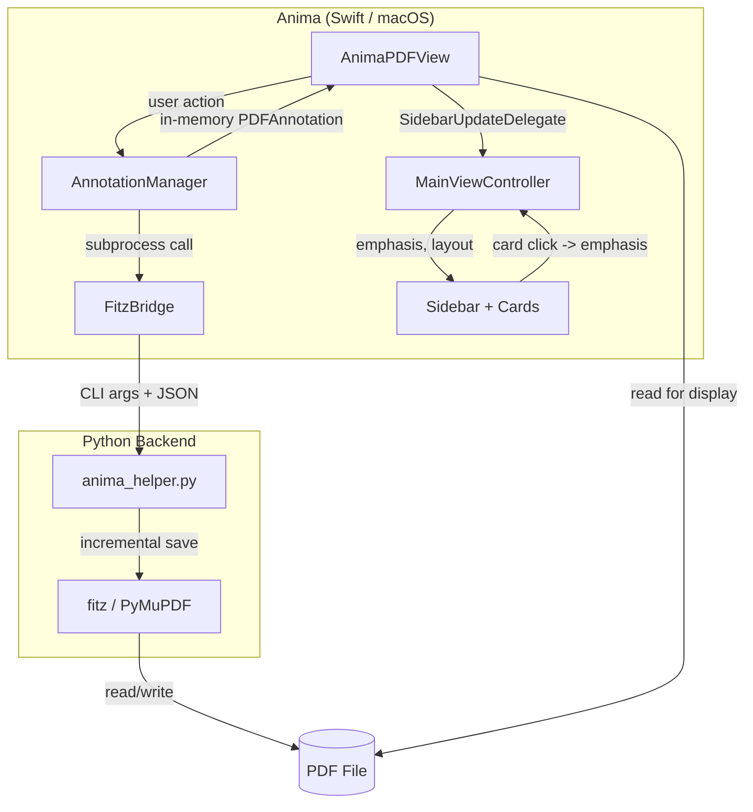

# Anima

**A minimal, no-frills PDF reader for annotation work.**

Latin *anima* -- "soul": what's left when you strip everything else away.

---

## Vision

Anima exists to serve one workflow: reading academic papers and wisdom tradition texts, highlighting passages, and adding comments. It replaces PDF-XChange Viewer in a macOS-native toolchain that flows from PDF -> highlights -> Obsidian notes.

**Core Philosophy:**

- **Minimalism**: Open. Read. Highlight. Comment. Save. That's it.
- **Non-destructive**: Incremental save via fitz preserves all existing annotations.
- **Toolchain-native**: Annotations are fully compatible with the `pdf-annotations` extraction pipeline and the `pdf://` URL scheme for Obsidian integration.
- **Single user**: Built for Frank. Configuration in code, not preferences dialogs.

**Design Philosophy -- Modality and Focus:**

Anima treats modality as a feature, not a limitation. When the user edits a comment, a modal input panel enforces focus on that single annotation. There is no cancel -- Escape always saves. This reflects a deeper principle: PDF annotations in Anima are a *scratchpad*. The real intellectual work happens outside the PDF, in Obsidian's Zettelkasten ("The Studio"). Highlights and comments are raw material to be developed into idea notes, not polished artifacts in their own right. This means Anima can and should force simplicity -- one highlight, one comment, one action at a time. Complexity belongs in the knowledge management layer, not in the reading layer.

**What Anima Does NOT Do:**

Print, sign, fill forms, edit PDF content, draw, stamp, redact, PDF/A compliance, thumbnail panels, bookmarks, touch-optimized UI, preferences dialog, or anything that adds complexity without serving the highlight+comment workflow.

---

## Architecture

Anima uses a hybrid approach: **PDFKit for rendering**, **fitz for writing**.



### Why Hybrid?

PDFKit's `writeToURL` is destructive to existing annotations:
- Loses opacity values (-1 instead of 0.4)
- Loses annotation IDs (the `/NM` field)
- Converts timezone representations in dates
- Doubles file size (full rewrite instead of incremental)
- Subtly shifts annotation rect coordinates

fitz's `save(incremental=True)` preserves everything. PDFKit remains ideal for
rendering, scrolling, text selection, zoom, and hit-testing.

### Dual-Write Pattern

`AnnotationManager` owns the dual-write sequence. When creating, editing, or
deleting highlights during a session:

1. **Persist to disk** -- `AnnotationManager` calls `anima_helper.py` via `FitzBridge`, which uses fitz to write the annotation with incremental save.
2. **Update in-memory** -- `AnnotationManager` adds, modifies, or removes a `PDFAnnotation` in PDFKit's in-memory document for immediate display.
3. **Notify sidebar** -- `AnimaPDFView` calls `sidebarDelegate.annotationsDidChange(onPageIndex:)` after the manager returns, so the sidebar rebuilds the affected page's cards.
4. **No reload** -- the document is never reloaded during a session, eliminating the scroll drift that plagued both PoCs.

`AnnotationManager` is a toolbox class: it holds no references to the view or document, receiving all context (document, page, annotation, isXRayMode) per-call. This keeps it testable and safe for future multi-document support.

On next app launch, PDFKit loads the fitz-written file from disk. The file is the single source of truth.

### Coordinate Systems

This is the critical cross-language contract:

- **PDFKit**: origin at **bottom-left**, y increases upward
- **fitz**: origin at **top-left**, y increases downward
- **Conversion**: `y_fitz = page_height - y_pdfkit`

The coordinate flip happens in Swift (`AnimaPDFView`) before calling the helper. The helper receives fitz-native coordinates only -- it has no knowledge of PDFKit.

**Note:** PDFKit's `annot.bounds` does not directly match the raw PDF `/Rect` values. PDFKit transforms the coordinates internally. When building test fixtures, always use the values reported by PDFKit, not the raw PDF rect.

### UUID Contract

Every annotation gets a UUID stored in the PDF `/NM` field. Swift generates UUIDs, passes them to the helper via CLI arguments, and uses them for hit-testing and identification. The helper sets `/NM` via fitz's xref API (`doc.xref_set_key`).

**Important:** On in-memory annotations, `/NM` must be set explicitly via `setValue(_:forAnnotationKey:)`. PDFKit maps `userName` to `/T` (the author field), not to `/NM`. Relying on `userName` alone for UUID storage causes the author field to overwrite the UUID. See `docs/SIDEBAR_DESIGN.md` "Known Gotchas" for full details.

### Bookmarks

Named page bookmarks are persisted independently from annotations. `anima_helper.py` stores a JSON array in the PDF catalog's private `/AnimaBookmarks` key, rather than modifying the PDF's native `/Outlines` tree. This preserves any table of contents already supplied by the document.

Bookmark pages are stored as fitz-native 0-based indices. `BookmarkManager` keeps the catalog-backed list in memory for the active reader session, refreshing it after every successful helper mutation. Reader-facing UI always presents the corresponding 1-based page number.

`AppDelegate` creates `BookmarkManager` alongside `AnnotationManager`; `AnimaPDFView` owns reader key dispatch and temporary bookmark dialogs; `FitzBridge` owns the Swift -> helper subprocess calls. Bookmark persistence and state are deliberately separate from annotation CRUD, sidebar extraction, search, and emphasis.

### Last-Page Restoration

Anima remembers each PDF's most recently displayed page. `anima_helper.py` stores a single fitz-native 0-based page index as a PDF string under the catalog's private `/AnimaLastPage` key, independent of `/AnimaBookmarks` and of the document's native outline. The index is persisted only when the active document is replaced and on application termination -- never on every page change -- so switching PDFs or quitting appends at most one incremental save.

`AppDelegate` owns the sequence: it persists the outgoing document's page (read on demand from the reader, not cached) before installing a replacement, and restores the incoming document's page after the PDF and sidebar are installed. `AnimaPDFView.restore(toPageIndex:)` clamps a stale stored index -- one saved when the PDF had more pages -- to the last page rather than failing. Restoring position is transparent navigation: it deliberately bypasses the far-jump seam that goto-page, both finds, bookmark jumps, and same-document `pdf://` links route through, and so does not enter the far-jump history described below.

`FitzBridge` reads return the helper's raw output (`getLastPage` -> `String?`); the caller decodes. Reader-facing page numbers remain 1-based; the stored index is 0-based.

### Far-Jump History

A far jump is a defined non-local reader transition: goto page, find in PDF, find in comments, `F3` in either search mode, jump to bookmark, and a same-document `pdf://` link. All six execute through `AnimaPDFView.farJump(to:)`, whose overloads mirror PDFKit's own `go(to:)` vocabulary so each caller keeps its existing scroll behavior. That seam is the only place the history is written.

`JumpStack` holds the history: a list of 0-based page indices with a pointer into it, owned by `AnimaPDFView`. Every far jump records two entries -- the page the reader is leaving, read from the reader rather than from the pointer, and the page it arrives at -- with either push declined when it would duplicate the previous entry. Ordinary scrolling records nothing; it only changes where a later far jump departs from. Recording is all-or-nothing: when a page index cannot be derived, the jump still happens and nothing is recorded, because a half-written entry would misstate where the reader stands and mislead every later walk.

`Cmd+E` and `Cmd+R` move the pointer first and then navigate, and they deliberately bypass the seam -- routing them through it would record every return as a new jump. They never modify the entries. The history is in-memory only and is cleared by `clearSearchAndSelection()` on document change, so a stored index can never address a page outside the current document; last-page restoration is the cross-document return path and stays outside the seam. The model, its traces, and the conventions considered and rejected are in `docs/JUMPSTACK_DESIGN.md`.

### The pdf-annotations Boundary

Anima has a second subprocess seam, distinct from `FitzBridge`. `PdfAnnotationsBridge` calls the neighbouring `pdf-annotations` project's resolver CLI to turn a `pdf://HASH` link into a file path. The contract is the CLI, not the code (`TARGET_ARCHITECTURE.md` §3): Anima never imports `pdf_annot`, runs the resolver inside that project's own venv with its root as the working directory, and consumes stdout and stderr. Resolution is stateless -- the hash-to-path index is rebuilt per invocation from filenames, so every click sees current truth.

The two bridges deliberately differ in how they fail. `FitzBridge` calls Anima's own helper in Anima's own venv, so a failure is a developer failure and is logged through `Swift.print`. `PdfAnnotationsBridge` consumes another project's declared interface, where an unknown hash or a duplicate `pdf_id` is an everyday outcome of library hygiene; it returns `ResolveOutcome` (`.resolved(path:)` / `.failed(message:)`) and the resolver's stderr reaches the user verbatim, because that text is written to be read.

`application(_:open:)` owns the reader-facing `pdf://` pipeline: it rejects opens behind a modal dialog, parses the URL's hash and optional 1-based page, resolves the hash through `PdfAnnotationsBridge`, then either activates the already open document or replaces it through the normal safe loading path. An explicit page query wins over stored last-page restoration; a link without one restores the incoming document's last position, while a no-page link for the already open document only activates Anima. Resolver failures and malformed or unavailable pages appear in alerts without changing the reader document. The same-document page jump routes through `AnimaPDFView`'s shared far-jump seam; the different-document path deliberately does not, because installing a document positions the reader rather than jumping within it.

---

## How to Use

### Highlight and comment

- **Select text + Enter** -- create a pink highlight.
- **`Cmd+H`** -- toggle persistent highlight mode. With the mode on, releasing the mouse after selecting text creates a highlight immediately.
- **Double-click a highlight** -- add or edit its comment. Escape in the comment editor saves the current text.
- **Click a highlight or comment card** -- emphasize that annotation and make it the target for Delete. Click the same emphasized highlight or card again, or press `Esc`, to clear the selection.
- **`Delete`** or **`Forward Delete`** -- remove the currently emphasized highlight.

Highlights start without comments by design. Add a comment later by double-clicking the highlight.

### Navigate

- **`Cmd+G`** -- go to a 1-based page number.
- **`Home` / `End`** and **`Cmd+Home` / `Cmd+End`** -- jump to the beginning or end of the document.
- **`Page Up` / `Page Down`** -- move by one screenful.
- **`Cmd+E`** -- walk back along the far-jump history: return to where the previous jump departed from, then further back.
- **`Cmd+R`** -- walk forward along the same history, up to the most recent jump target.

Every far jump records where it left and where it arrived, so a walk stops at both. Several search hits on one page count as a single stop. Walking back and then jumping somewhere new discards whatever lay ahead, exactly as a browser's back/forward pair does. The history is per-document and vanishes when a different PDF is opened; it never disturbs an active search, so a walk leaves the current find hit and its highlight in place.

### Bookmarks

- **`Cmd+B`** -- add a named bookmark for the current page. The prompt identifies pages using normal 1-based reader numbering.
- Bookmark names are unique case-insensitively. If the name already exists, choose **Re-point** to move it to the current page or **Keep Existing** to leave it unchanged.
- **`Cmd+J`** -- open JumpStation. It lists bookmark names and normal 1-based page numbers in two columns. Mouse clicks, right-clicks, and double-clicks select a row only; `Up`/`Down` also move selection. `Enter` jumps to the selected bookmark and `Esc` closes the panel.
- **`Cmd+D`** -- while JumpStation is open, delete its selected bookmark after confirmation. The list refreshes immediately, and the panel closes if the final bookmark is removed.
- If no bookmarks exist, `Cmd+J` reports that state instead of opening an empty picker.

Bookmarks persist in the PDF itself and survive reopening without altering the document's native outline/table of contents.

### Search

- **`Cmd+F`** -- search PDF text from the beginning of the current page forward. The active hit appears pale green in the PDF.
- **`Cmd+Shift+F`** -- search annotation comments only from the current page forward. Matching cards receive thin pale-green borders; the current hit has a thicker pale-green border.
- **`F3`** -- advance to the next hit in the active search. Searches stop at document end and do not wrap.
- **`Esc`** -- clear the active PDF-text search, comment search, or annotation emphasis, in that order.

PDF-text search results are temporary reader selections, not annotation selections. Finding text never creates a highlight, including while persistent H mode is enabled. Starting a search clears annotation emphasis; clicking a highlight or card exits search and returns to normal annotation interaction.

### Inspect native PDF comments

- **`Cmd+P`** -- toggle X-Ray mode, which reveals native PDF popup indicators for comments. This is primarily a diagnostic view; ordinary reading keeps them suppressed in favor of the sidebar.

### Highlight Workflow

Highlights are created **without a comment**. This keeps the flow fast -- especially in persistent highlight mode where mouseUp instantly highlights. To add or edit a comment after the fact, double-click the highlight. This matches the PDF-XChange Viewer workflow where highlighting and commenting are separate actions.

Highlights are **page-scoped by design**: a selection that spans a page break creates the highlight only on the first page -- lines on the following page are dropped. This is intended behavior, not a limitation. Highlights should be specific; a continuation on the next page is its own highlight, connected via the "link" command comment per the existing annotation conventions (see `pdf-annotations` for details).

### Sidebar

The sidebar is a fixed-width panel on the right showing **comment cards** -- one per annotation with a non-empty comment. Cards are positioned vertically to align with their corresponding highlights in the PDF, using anchor-based layout with collision avoidance.

Key capabilities:
- **Live updates**: Cards appear, update, or disappear immediately when comments are added, edited, or deleted during a session.
- **Bidirectional emphasis**: Clicking a card emphasizes the corresponding highlight in the PDF (light yellow), and clicking a highlight emphasizes the corresponding card. Both directions use the same visual treatment. Emphasis is unified with the Delete key target, so the user always sees which highlight will be affected.
- **Scroll sync**: The sidebar scrolls in lockstep with the PDF.
- **Per-page architecture**: Each PDF page has its own page-sidebar container, enabling efficient per-page rebuilds on mutation.

See `SIDEBAR_DESIGN.md` for the full design document.

---

## Integration with Existing Toolchain

Anima is one piece of a larger workflow for academic study and contemplative practice:

```
PDF reading + highlighting (Anima)
        ↓
Annotation extraction (pdf-annotations)
        ↓
Obsidian bibnotes with highlights + comments
        ↓
Zettelkasten: idea notes, workbenches, Folgezettel sequences
```

- **`pdf-annotations`**: Extracts highlights and comments from PDFs into Obsidian Markdown notes. Uses fitz -- Anima's annotations are fully compatible. Standard `/Annot` with `/Subtype /Highlight`, `/Contents` for comments, `QuadPoints` for precise multi-line highlighting.

- **`pdf://` URL scheme**: Obsidian bibnotes reference PDFs via `pdf://HASH?page=N`. Anima claims the scheme on macOS and resolves the hash through the `pdf-annotations` resolver CLI. A page query is 1-based and opens or activates the PDF at that page; without a page query, a newly opened document restores its last page while an already open document is simply activated. Unknown hashes, duplicate IDs, and malformed or unavailable pages report their failures in Anima rather than returning through the retired Windows Parallels route.

- **Obsidian "The Studio"**: The Zettelkasten knowledge management system where bibnotes, idea notes, and workbenches live. Anima serves as the PDF reading layer that feeds this system.

---

## Project Structure

The authoritative file inventory is `project_tree.txt` (generated via `make gentree`, included in every filesdump). This section is the annotated map of what matters -- curated and selective; skeleton details may lag behind the generated tree by design.

```
anima/
├── Anima/Anima/                    ← Swift source files (app target)
│   ├── AnimaPDFView.swift          ← PDFView subclass: keyboard, mouse, hit-testing
│   ├── AnnotationManager.swift     ← Annotation CRUD: create, edit, delete (dual-write)
│   ├── BookmarkManager.swift       ← Bookmark session state and catalog persistence coordination
│   ├── AppDelegate.swift           ← Window setup, PDF loading, manager wiring
│   ├── FitzBridge.swift            ← Subprocess bridge to Python helper
│   ├── PdfAnnotationsBridge.swift  ← Subprocess bridge to the pdf-annotations resolver CLI
│   ├── JumpStack.swift             ← Far-jump history: page-index list, pointer, back/forward
│   ├── JumpStationPanel.swift      ← Modal bookmark navigation and deletion picker
│   ├── MainViewController.swift    ← NSSplitView layout, sidebar sync & emphasis
│   ├── SidebarExtractor.swift      ← Parses annotations into sidebar CommentCard structs
│   ├── CommentCardView.swift       ← Custom NSView for rendering sidebar cards
│   └── CommentInputPanel.swift     ← Modal comment editor (replaces NSAlert)
├── Anima/AnimaTests/               ← Swift Testing unit tests
│   ├── AnimaTests.swift            ← Cross-boundary integration tests
│   ├── JumpStackTests.swift        ← Far-jump history traces as pure unit tests
│   ├── SidebarExtractorTests.swift ← Sidebar extraction mechanics (normally excluded from filesdump)
│   └── AnnotationGeometryTests.swift ← Pure coordinate/geometry tests (normally excluded from filesdump)
├── tools/
│   ├── anima_helper.py             ← CLI: add-highlight, edit-comment, delete-highlight
│   ├── concat_files.py             ← Filesdump generator for LLM sessions
│   └── requirements.txt            ← Python dependencies (PyMuPDF)
├── tests/                          ← Python tests (pytest)
│   ├── conftest.py                 ← Fixtures: test_pdf, run_helper
│   └── test_anima_helper.py        ← round-trip, contracts, edge cases
├── data/
│   └── input_original.pdf          ← Test PDF (unmodified backup)
├── docs/                           ← Design notes, historical unless marked current
│   ├── BOOKMARKS_DESIGN.md         ← Bookmark and navigation design (to 2026-07-16)
│   └── SIDEBAR_DESIGN.md           ← Sidebar design and known gotchas (historical)
├── CRITICAL_RULES.md               ← Non-negotiable collaboration rules
├── GOALS.md                        ← Strategic direction & roadmap
├── HISTORY.md                      ← Resolved-work record (on the heap)
├── LLM_INSTRUCTIONS.md             ← AI session context and conventions
├── TARGET_ARCHITECTURE.md          ← `pdf://` link resolution: contract, work plan, acceptance
├── TODO.md                         ← Forward-looking task scratchpad
├── Makefile                        ← Build, setup, and utility targets
├── pyproject.toml                  ← Project metadata, pytest & black config
└── manifest.lst                    ← File list for filesdump generation
```

### Module Overview

`AnimaPDFView.swift` -- Subclasses `PDFView` to intercept keyboard and mouse events. Handles persistent highlight mode (`Cmd+H`, mouseUp auto-highlight), X-Ray mode (`Cmd+P` for popup visibility), goto page (`Cmd+G`), bookmark creation (`Cmd+B`), JumpStation presentation (`Cmd+J`), far-jump history walks (`Cmd+E` / `Cmd+R`), hit-testing for highlight clicks, and emphasis/selection coordination via `SidebarUpdateDelegate`. All annotation CRUD (create, edit, delete) is delegated to `AnnotationManager`; bookmark persistence is delegated to `BookmarkManager`. Defines the `SidebarUpdateDelegate` protocol and notifies its delegate after every annotation mutation and highlight click so the sidebar stays in sync.

**`AnnotationManager.swift`** -- Toolbox class that owns all annotation CRUD operations and the dual-write pattern. Creates highlights (with quad math and coordinate conversion from PDFKit to fitz space), edits comments (showing the modal `CommentInputPanel`, writing via fitz, updating in-memory `/AnimaComment`), and deletes highlights. Holds no references to the view or document -- all context is passed per-call, keeping the class testable and safe for multi-document (tabs) support. Also owns shared constants (`authorName`, `highlightColor`, `highlightOpacity`) and helpers (`annotationUUID`, `ensurePopupExists`).

**`BookmarkManager.swift`** -- Toolbox-style owner of the active document's in-memory named-page bookmark list. It decodes bookmark JSON returned by `FitzBridge`, delegates set/delete persistence to the helper, and reloads after each successful mutation so helper-owned catalog semantics remain authoritative. Bookmark page indices are 0-based internally; reader UI converts them to 1-based display values.

**`AppDelegate.swift`** -- Creates the window, loads the PDF, creates and wires the `AnnotationManager`, and sets up the NSEvent monitor as a fallback for keyboard events (PDFKit's internal `PDFDocumentView` sometimes captures keyboard focus).

**`MainViewController.swift`** -- Manages the dual-pane layout (`NSSplitView`), instantiates the `SidebarScrollView`, and coordinates the complex scrolling math and `scaleFactor` logic required to keep the sidebar perfectly synchronized with the PDF. Conforms to `SidebarUpdateDelegate` to handle live sidebar rebuilds on annotation mutation. Manages bidirectional highlight emphasis: clicking a sidebar card or a highlight in the PDF triggers the same shared emphasis logic, with toggle behavior on single-click and ensure-on behavior on double-click. Emphasis is unified with `selectedAnnotation` so the Delete key targets the visually emphasized highlight.

**`SidebarExtractor.swift`** -- The pure data layer for the sidebar. Scans the PDFDocument for highlight annotations and safely extracts their text, UUID (/NM), author (/T), modification date, and vertical anchor points. Converts this raw PDFKit data into sorted `CommentCard` structs, keeping the extraction logic completely decoupled from the UI. Supports both document-level and per-page extraction (the latter used by the live-update path to rebuild a single page efficiently). Tested with `AnimaTests.swift`.

**`FitzBridge.swift`** -- Static methods that call `anima_helper.py` via `Process()` (Swift's subprocess equivalent). Captures stdout/stderr, checks exit codes, and resolves the Python executable from the project's `.venv`. It provides annotation mutation calls, bookmark list/set/delete calls, and last-page get/set. Reads return the helper's raw stdout as `String?` and mutations return `Bool`, so decoding stays with the caller: raw bookmark-list JSON is decoded by `BookmarkManager`, which owns the Swift data model and session state, and the last-page string is decoded by `AppDelegate`.

**`PdfAnnotationsBridge.swift`** -- One static method, `resolve(hash:pdfAnnotationsRoot:)`, running the pdf-annotations resolver as a subprocess and returning `.resolved(path:)` or `.failed(message:)`. Like `FitzBridge` it holds no paths of its own: `AppDelegate` passes the project root per call. It reads both pipes before waiting for exit, and guards the two off-contract cases (nonzero exit with silent stderr, exit 0 with no path) so a protocol violation surfaces as prose rather than as an empty alert.

**`anima_helper.py`** -- Standalone CLI tool with eight subcommands across three concerns: annotations (`add-highlight`, `edit-comment`, `delete-highlight`), bookmarks (`list-bookmarks`, `set-bookmark`, `delete-bookmark`), and reading position (`get-last-page`, `set-last-page`).

**`CommentCardView.swift`** -- The visual representation of a single annotation in the sidebar. A custom NSView that uses Auto Layout to dynamically size itself based on the length of the comment text. Handles all visual styling, including the muted typography applied to structural pipeline commands (e.g., "link" or "H2"). Reports clicks via an `onClicked` closure and supports active/inactive visual states for the emphasis feature.

**`CommentInputPanel.swift`** -- A modal `NSPanel` for adding and editing highlight comments. Replaces the previous `NSAlert`-based dialog with a proper multi-line text editor (`NSTextView`). Styled to match `CommentCardView` -- same background color, corner radius, fonts, and color palette. Escape saves and closes (no cancel), Enter inserts newlines. The panel is resizable and draggable. Each invocation creates a fresh instance; the panel is not reused across calls.

**`JumpStack.swift`** -- A small value type holding the far-jump history: an unbounded list of 0-based page indices and a pointer into it, with operations to record a jump, walk back, walk forward, and clear. It knows nothing of PDFKit or AppKit -- `back()` and `forward()` return the page to navigate to, or `nil` when the walk has reached an end, leaving navigation and the beep to `AnimaPDFView`. That independence is what lets the design document's traces be pinned as pure unit tests without a fixture PDF.

**`JumpStationPanel.swift`** -- A modal `NSPanel` for bookmark navigation and deletion. It renders the active document's bookmarks in name and 1-based page columns, owns temporary table selection and local keyboard dispatch, and reports Enter-to-jump or confirmed deletion through callbacks. It deliberately has no PDFKit, file-path, or persistence knowledge: `AnimaPDFView` owns navigation and delegates deletion to `BookmarkManager`. The future prefix-input/filtering behavior will extend this panel rather than replace it.

---

## Development

### Prerequisites

- **Xcode** (macOS, with macOS SDK)
- **Python 3** with venv support
- **SwiftFormat** (`brew install swiftformat`) -- Swift code formatting

### Setup

```bash
make setup    # Create Python venv, install PyMuPDF
```

### Build & Run

Open `Anima/Anima.xcodeproj` in Xcode, then **Cmd+R** to build and run.

### Testing

```bash
make test           # Run Python tests (quiet)
make test-verbose   # Run Python tests with output
```

Python test suite (`tests/test_anima_helper.py`):
- `TestAddHighlight` -- basic round-trip, with-comment, multi-quad
- `TestEditComment` -- add-then-edit (with opacity survival check), clear-comment
- `TestDeleteHighlight` -- create-then-delete round-trip
- `TestUUIDContract` -- xref-level /NM verification
- `TestIncrementalSavePreservation` -- pre-existing annotations survive new writes
- `TestErrorHandling` -- invalid page, missing file, nonexistent UUID
- `TestBookmarks` -- catalog-backed list/set/delete, case-insensitive upsert and deletion, 0-based page validation, and native-TOC preservation

To inspect test output PDFs: `ANIMA_KEEP_TEST_OUTPUT=1 make test` (copies modified PDFs to `tmp/tests/` for manual inspection).

Swift tests run via Xcode: **Cmd+U** or **Product -> Test**.

Current Swift test suite:

- In `AnimaTests.swift` (cross-boundary / behavioral):
  - `testFitzBridgeAddHighlightRoundTrip` -- Real Swift -> Python -> fitz subprocess boundary
  - `testBookmarkManagerPersistenceRoundTrip` -- Swift bookmark manager -> helper -> PDF catalog round-trip
  - `testCrossPageSelectionOnlyHighlightsFirstPage` -- Page-scoped highlight creation for cross-page selections

- In `SidebarExtractorTests.swift` (extraction mechanics):
  - `testSidebarExtraction` -- Golden JSON test against `sidebar_basic.pdf`
  - `testMultiPageExtraction` -- Multi-page extraction against `sidebar_page_extract.pdf`
  - `testPerPageExtraction` -- Per-page extraction (page 0, page 1, empty page 2)
  - `testPerPageConsistencyWithDocumentLevel` -- Reassembly matches document-level
  - `testInMemoryAnnotationRoundTrip` -- Verifies in-memory annotations produce
    correct `CommentCard` data, guarding against dual-write field omissions

- In `AnnotationGeometryTests.swift` (pure geometry):
  - `testFitzQuadYFlip` -- Pins the PDFKit -> fitz y-flip coordinate contract
  - `testQuadPointsConstruction` -- Pins QuadPoints corner order and count

### Opening PDFs

Anima accepts PDFs through four entry points, checked in this order:

1. **Finder** -- Double-click a PDF (or right-click -> Open With -> Anima). Requires the Info.plist `CFBundleDocumentTypes` registration. To make Anima the default viewer: right-click any PDF -> Get Info -> Open With -> Anima -> Change All.

2. **Command line** -- Pass a PDF path as an argument:
   ```bash
   open -a Anima --args ~/Papers/some-paper.pdf
   ```

3. **`pdf://` links** -- Obsidian links use `pdf://HASH` or `pdf://HASH?page=N`, where `N` is a 1-based page number. Anima resolves the hash through the `pdf-annotations` resolver CLI. A link with `?page=N` opens or activates the PDF at page `N`; without `page`, a newly opened PDF restores its stored last page, while an already open PDF is only activated. Unknown hashes, duplicate IDs, malformed pages, and unavailable pages show an alert without changing the reader document.

4. **Dev fallback** -- If none of the above provides a file, Anima opens `projectRoot/data/input.pdf` automatically. If that doesn't exist either, Anima prints an error and exits.

**Hot replacement:** If Anima is already running, opening a different PDF via Finder, "Open With", or dropping a file onto the Dock icon replaces the displayed PDF. The outgoing document's search hits, comment-search state, annotation/card emphasis, text selection, and Delete-key target are cleared; bookmarks are reloaded for the new file. If the new file cannot be parsed, the current document stays open and an alert is shown. Reopening the file already displayed is declined rather than reloaded, so the reading position, search state, emphasis, selection, and far-jump history all survive the gesture.

**Multiple instances:** Anima is single-window by design. To open several PDFs simultaneously, launch separate processes with `open -n`:

```bash
open -n -a Anima --args ~/Papers/paper-a.pdf
open -n -a Anima --args ~/Papers/paper-b.pdf
```

Each instance is fully independent (separate window, sidebar, bookmarks, search, emphasis, comment panel geometry). `pdf://` links from Obsidian deliberately do not use this path: they are delivered to the running instance and will replace the active document (`TARGET_ARCHITECTURE.md` §6.3).

**Shell alias** (optional convenience for `~/.zshrc`):

```bash
alias anima='open /Users/fschuhi/Library/Developer/Xcode/DerivedData/Anima-esbrhbulontpfabyujxyeppsbgua/Build/Products/Debug/Anima.app'
```

### Path Resolution

All derived paths flow from a single `projectRoot` constant in `AppDelegate.swift`:

```
projectRoot  = /Users/fschuhi/Projects/anima
helperPath   = projectRoot + /tools/anima_helper.py      (passed to AnnotationManager)
dev fallback = projectRoot + /data/input.pdf
venv python  = derived by FitzBridge from helperPath      (two levels up + .venv/bin/python3)
```

To move the project, change `projectRoot` in AppDelegate -- nothing else.

A second constant in the same place locates the neighbouring pdf-annotations project, whose resolver CLI Anima calls as a subprocess:

```
pdfAnnotationsRoot = /Users/fschuhi/Projects/pdf-annotations
```

It is deliberately an independent absolute path, not a sibling derived from `projectRoot`. The two projects are joined by a frozen CLI contract (see `TARGET_ARCHITECTURE.md`), not by a shared filesystem layout, and either may move without the other.

### Code Formatting

```bash
make format   # Format Swift (SwiftFormat) and Python (black) files
```

### Utilities

```bash
make showtree     # Display project structure
make filesdump    # Generate context dump for LLM sessions
make help         # Show all targets
make clean        # Remove build output, venv, cache
```

---

## Technical Notes

### Swift Gotchas

- `print()` inside `NSView` subclasses is ambiguous (NSView.print = "send to printer"). Use `Swift.print()` for console output.
- `selectionsByLine()` returns `[PDFSelection]`, not Optional -- don't `guard let`.
- `document.index(for:)` returns `Int`, not Optional -- same issue.
- Command-line GUI apps need `setActivationPolicy(.regular)` for keyboard focus. Not needed in Xcode .app bundles.
- PDFKit maps `userName` to `/T` (author), not `/NM` (unique name). Set `/NM` explicitly via `setValue(_:forAnnotationKey:)` for UUID storage. Set `/T` after `userName` to avoid the mapping overwriting the author with the UUID.

### PDFKit Coordinate Note

PDFKit's `annot.bounds` values do not match the raw PDF `/Rect` midpoints. PDFKit applies an internal coordinate transformation. When comparing with fitz or raw PDF data, always verify against actual PDFKit-reported values. The test fixtures contain PDFKit values, not raw PDF values.

### Hit-Testing Note

Clicking a highlight is resolved via `PDFPage.annotation(at:)` first, with a fallback that tests the annotation's bounding rect (`annot.bounds.contains(point)`). For a multi-line highlight the bounds are the union rectangle of all quads, so a click in the visually empty area inside that union (e.g. right of a short last line) still hits the highlight. Accepted as a forgiving hit target: clicking anywhere in the highlighted range emphasizes it, and near-misses often do too.

### Highlight Rendering Compatibility

PDF-XChange Viewer and Chromium-based PDF renderers honor fitz's generated highlight appearance stream, while Apple PDFKit renders markup highlights from their high-level annotation properties and displays the same stored pink more saturated. Anima therefore deliberately maintains two representations:

- **Persisted PDF representation:** `anima_helper.py` writes the established pink `[1.0, 0.75, 0.80]` at opacity `0.4`; fitz generates the corresponding appearance stream. This remains the compatibility contract for PDF-XChange Viewer, browsers, and the downstream `pdf-annotations` workflow.
- **In-memory PDFKit display representation:** after loading, Anima changes highlight `PDFAnnotation.color` to pale `#FFE6EA`; newly created in-memory annotations use the same display color immediately. Anima never saves through PDFKit, so this display-only override does not modify the PDF file.

Do not collapse these values into one shared constant without re-running the cross-renderer comparison. The distinction is intentional renderer compatibility, not a persistence mismatch.

### Appearance Stream Caveat

When fitz calls `annot.update()`, it regenerates the annotation's appearance stream (the low-level PDF drawing instructions). Highlights edited by fitz may render slightly differently in PDF-XChange Viewer compared to annotations originally created by Viewer, even though the underlying data (color, opacity, coordinates) is identical. PDFKit renders them consistently regardless.

### fitz Empty Content Quirk

`annot.set_info()` with `info["content"] = ""` is silently ignored by fitz -- the previous content value survives. To clear a comment, use `doc.xref_set_key(annot.xref, "Contents", "()")` to write an empty PDF string directly at the xref level. This is handled in `anima_helper.py`'s `cmd_edit_comment`.

### Background

Frank is learning Swift from scratch for this project. Python and PDF annotation internals are his area of expertise. The hybrid Swift+Python architecture leverages both: Swift for native macOS UI, Python for the annotation backend where fitz knowledge is essential.
